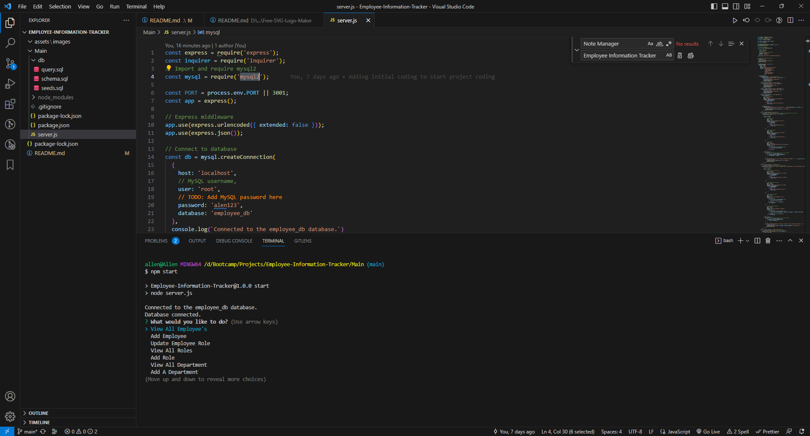
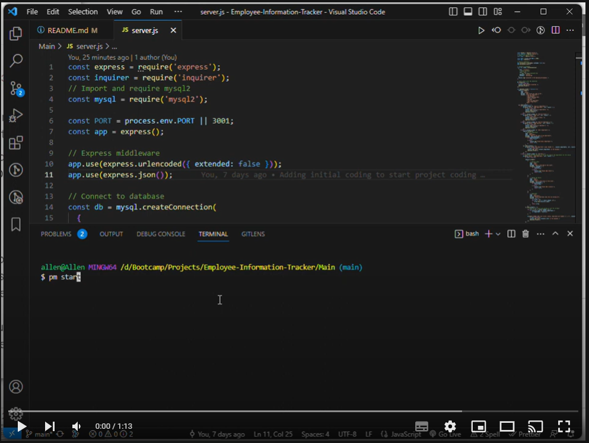

# Employee Information Tracker

## Employee Information Tracker
This repository was created to allow the users to create and manage their employee, roles and departments records.

This project contain a few files that allows this web app to run and create and manage employee records, this repo doesn't contain a web interface as it only can be run via command box after downloading and installing the node npm libraries.

This repo mainly build using nodeJS & nodeJS libraries that allow this app to run and and manage employee records.

This project is mainly focused on showing up my skills in JS with the integration of NodeJS libraries and improve on it as I progress my journey of learning full stack. 

This repo is designed to manage and store the records on database called employee_db that allow the user to retrieve and manage when required.
## GitHub Repo URL
https://github.com/AllenHirmiz/Employee-Information-Tracker

## Table of Contents
When running the app via command box you will be presented with few option to select from.

## Installation
Runs via Command Box 
## Technologies Used
Employee Information Tracker project is built using the following technologies:
JavaScript: Dynamic and interactive elements, such as animations and form validation.
NodeJS:
inquirer Library: 
express Library:
mysql2 Library

## Mock-Up

The following image shows the web application's appearance and functionality:

## Command line Screenshot
Command line screenshot displaying the set of option that would be available when running the app.

## Command line file example video
Youtube video that go through the options available for the user when running the app via command box.

